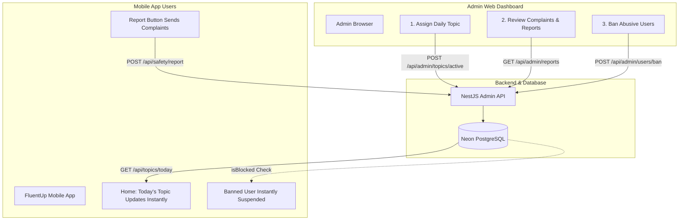

# 🛡️ FluentUp - Admin Web App: Complete Architecture & Step-by-Step Guide

> **Document Version:** 1.0.0  
> **Target Audience:** Product Owner & Developers  
> **Server Infrastructure Cost:** **$0.00 / ₹0.00 (Permanent Free Tier)**  
> **Tech Stack:** React (Vite) + TypeScript + Vanilla CSS + NestJS + Neon PostgreSQL  

---

## 📑 Table of Contents
1. [Overview & 100% Zero-Cost Architecture](#1-overview--100-zero-cost-architecture)
2. [How Admin Controls the Mobile App (The Control Bridge)](#2-how-admin-controls-the-mobile-app-the-control-bridge)
3. [Required Tools & Prerequisites](#3-required-tools--prerequisites)
4. [Admin Web App Feature Breakdown](#4-admin-web-app-feature-breakdown)
   - [A. Complaints & Safety Moderation](#a-complaints--safety-moderation)
   - [B. Daily Topic Manager & Assignment](#b-daily-topic-manager--assignment)
   - [C. User Moderation & Ban Management](#c-user-moderation--ban-management)
   - [D. Real-Time Platform Analytics](#d-real-time-platform-analytics)
5. [Step-by-Step Implementation Plan](#5-step-by-step-implementation-plan)
6. [Security & Admin Access Control](#6-security--admin-access-control)
7. [Zero-Cost Free Hosting & Deployment Guide](#7-zero-cost-free-hosting--deployment-guide)

---

## 1. Overview & 100% Zero-Cost Architecture

FluentUp Admin Web App ek dedicated browser-based web dashboard hai jahan se aap poore FluentUp mobile ecosystem ko aasaani se manage aur control kar sakte hain.

### 💰 Zero-Cost Proof ($0.00 / ₹0.00)

| Layer | Technology | Cost | Why is it Free? |
| :--- | :--- | :---: | :--- |
| **Web Frontend** | React + Vite (SPA) | **$0.00** | Vercel / Netlify / Cloudflare Pages par static web apps hamesha ke liye free host hoti hain. |
| **Backend API** | NestJS (Existing Server) | **$0.00** | Aapke existing Render backend server me hi `/api/admin/*` routes add honge, koi naya server nahi chahiye. |
| **Database** | Neon PostgreSQL | **$0.00** | Existing database me hi `daily_topics` aur `reports` table use hongi, koi naya database nahi chahiye. |
| **Admin Auth** | Admin Secret Key / JWT | **$0.00** | Backend ke `.env` me secure admin passcode set hoga, koi third-party paid auth service nahi chahiye. |

---

## 2. How Admin Controls the Mobile App (The Control Bridge)

Admin Web App mobile app ko 3 powerful real-time bridges ke through control karega:



### 🌉 Bridge 1: Daily Conversation Topic Control
1. **Admin Action**: Admin dashboard me jakar naya topic likhta hai (e.g. *"AI & Future of Jobs"*) aur 3 questions/cues daalkar **"Set as Active Today"** button dabata hai.
2. **Database Update**: Server database me is topic ko `isActive = true` set kar deta hai.
3. **Mobile App Reflection**: Jaise hi koi bhi user mobile app kholta hai, Home screen ka *"Today's Topic"* Bento card automatically naya topic aur 3 cues display karne lagta hai. Jab do users call me connect honge, unka shared topic wahi show hoga!

### 🌉 Bridge 2: Complaint & Report Resolution
1. **Mobile Action**: Call khatam hone par agar kisi partner ne bad behavior kiya, to user **"Report partner"** button dabakar reason submit karta hai.
2. **Admin Dashboard**: Admin ke **Complaints Hub** me turant red badge ke sath notification aati hai. Admin dekh sakta hai:
   - Kisne complain ki (Reporter)
   - Kiske khilaaf ki (Reported User)
   - Reason kya tha
   - Call kab hui thi
3. **Admin Action**: Admin ke paas 3 buttons honge:
   - **`Dismiss`**: Agar complain galat ho.
   - **`Resolve`**: Agar warning de di gayi ho.
   - **`Ban User`**: Agar serious abuse ho.

### 🌉 Bridge 3: 1-Click User Suspension / Ban
1. **Admin Action**: Admin kisi bhi abusive user ke samne **"Ban User"** toggle on kar deta hai.
2. **Database Update**: Database me user ka `isBlocked = true` ho jata hai.
3. **Mobile App Block**: 
   - Agar banned user app me login karne ki koshish karega, app turant error dikhayegi: *"Your account has been suspended for violating community guidelines."*
   - Woh matchmaking queue me enter nahi ho sakega aur na hi kisi ko call kar sakega.

---

## 3. Required Tools & Prerequisites

Aapko kisi bhi nayi paid cheez ki zaroorat nahi hai. Sabhi tools free aur open-source hain:

1. **Node.js (v18+)**: Jo aapke computer par pehle se installed hai.
2. **Vite**: Super-fast React frontend bundler (Free).
3. **Lucide Icons**: Clean, modern dashboard icons (Free).
4. **Vercel CLI / GitHub Integration**: 1-click cloud deployment ke liye (Free).

---

## 4. Admin Web App Feature Breakdown

### A. Complaints & Safety Moderation (`/complaints`)
* **Status Badges**: `PENDING`, `RESOLVED`, `DISMISSED`.
* **Details Modal**:
  - Reporter Name & Level
  - Target User Name & Level
  - Complaint Timestamp & Call Session Duration
  - Full Complaint Text
* **Actions**:
  - 🟢 **Resolve** (Mark safe)
  - ⚪ **Dismiss** (Invalid report)
  - 🔴 **Permanent Ban** (Sets `isBlocked = true`)

### B. Daily Topic Manager & Assignment (`/topics`)
* **Topic Creation Form**:
  - Topic Title (e.g. *Career Ambitions & Modern Workplaces*)
  - Category Tag (e.g. *Business & Career*, *Travel*, *Culture*)
  - 3 Conversation Cues (e.g. *1. What is your dream role? 2. Remote work vs office? 3. Work-life balance tips?*)
* **1-Click "Activate Today" Toggle**: Turant poore mobile network par live topic switch ho jata hai.
* **Topic Calendar / Library**: Purane topics ko re-use karne ka option.

### C. User Moderation & Ban Management (`/users`)
* **Search & Filter**: Email, Username, ya CEFR Level (`B1`, `B2`, `C1`) se instant search.
* **Learner Card / Row**:
  - Avatar, Name, Email
  - CEFR Fluency Score
  - Total Practice Minutes Spoken
  - Total Conversations Completed
  - Account Status: Active vs Banned
* **Ban / Unban Toggle**: Instant moderation control.

### D. Real-Time Platform Analytics (`/overview`)
* **Live KPI Stat Cards**:
  - 👥 Total Registered Learners
  - ⏱️ Total Practice Minutes Spoken Platform-Wide
  - 📞 Total Calls Completed Today
  - 🚨 Pending Complaints Needing Review
* **Recent Activity Feed**: Haal hi me complete hui calls aur new registrations ka feed.

---

## 5. Step-by-Step Implementation Plan

### Step 1: Backend Database & Admin APIs (NestJS)
1. `server/prisma/schema.prisma` me `DailyTopic` model add karna:
   ```prisma
   model DailyTopic {
     id           String    @id @default(uuid())
     title        String
     category     String
     cues         String[]
     isActive     Boolean   @default(false)
     createdAt    DateTime  @default(now())
     updatedAt    DateTime  @updatedAt

     @@map("daily_topics")
   }
   ```
2. Database update karna: `npx prisma db push`.
3. `server/src/admin` module banana:
   - `admin.guard.ts`: Header `x-admin-key` verify karega.
   - `admin.controller.ts`: Reports, Users, Topics, aur Stats ke endpoints.
   - `admin.service.ts`: Business logic aur moderation handlers.
4. Public mobile endpoint create karna: `GET /api/topics/today`.

### Step 2: Mobile App Dynamic Bridge
1. Mobile app ke Home screen (`fluentUp/app/(tabs)/index.tsx`) me hardcoded topic ki jagah backend se live topic fetch karna:
   ```typescript
   const [todayTopic, setTodayTopic] = useState({ title: 'Urban Travel', cues: 3 });
   // Loads active topic assigned by admin
   ```

### Step 3: Admin Web App Frontend Construction
1. Root folder me `admin/` directory create karna using Vite:
   ```powershell
   npm create vite@latest admin -- --template react-ts
   ```
2. Sleek, high-converting aesthetic design system implement karna:
   - Luxury Dark/Light Modern Dashboard Palette
   - Card Glassmorphism & Micro-animations
   - Responsive sidebar navigation (`Overview`, `Complaints`, `Topics`, `Users`)
3. API Client banana: `src/api/adminClient.ts` jo server se communicate karega.

### Step 4: Admin Web Pages
1. **LoginPage (`src/pages/Login.tsx`)**: Secure passcode authentication.
2. **OverviewPage (`src/pages/Overview.tsx`)**: Live metrics aur stats.
3. **ComplaintsPage (`src/pages/Complaints.tsx`)**: Resolve & ban controls.
4. **TopicsPage (`src/pages/Topics.tsx`)**: Daily topic selector & creator.
5. **UsersPage (`src/pages/Users.tsx`)**: User directory & account status.

---

## 6. Security & Admin Access Control

1. **Admin Secret Key**:
   Backend ke `.env` me ek high-entropy admin secret key set hogi:
   ```env
   ADMIN_SECRET_KEY="fluentup_super_secret_admin_key_2026"
   ```
2. **Request Protection**:
   Admin dashboard jab bhi server ko koi request bhejega, header me yeh key auto-inject hogi:
   ```http
   x-admin-key: fluentup_super_secret_admin_key_2026
   ```
3. **Brute Force Protection**:
   Wrong password enter karne par 5 attempts ke baad lock.

---

## 7. Zero-Cost Free Hosting & Deployment Guide

Admin Web App ko live internet par host karne ke 2 sabse aasan aur 100% Free tarike hain:

### Option A: Vercel (Recommended - 100% Free)
1. `admin/` folder me terminal open karein:
   ```powershell
   cd admin
   npm install -g vercel
   vercel
   ```
2. Vercel aapko ek free URL de dega (e.g. `https://fluentup-admin.vercel.app`).
3. Aap apne phone ya laptop par kisi bhi browser se kabhi bhi yeh link open karke dashboard use kar sakte hain!

### Option B: Render Static Site (100% Free)
1. Render dashboard me **New > Static Site** select karein.
2. Apne GitHub repository ko connect karein.
3. Build command: `cd admin && npm install && npm run build`
4. Publish directory: `admin/dist`
5. Render aapko free live URL provide kar dega!

---

## 🏁 Summary

Is plan se aapko:
* ✅ **100% Zero-Cost Architecture** milegi (Lifetime Free Tier).
* ✅ **Full Control**: Abusive users ko 1-tap me ban kar sakenge aur reports dekh sakenge.
* ✅ **Daily Engagement**: Roz naya conversation topic assign kar sakenge jo mobile users ke app me instantly reflect hoga.
