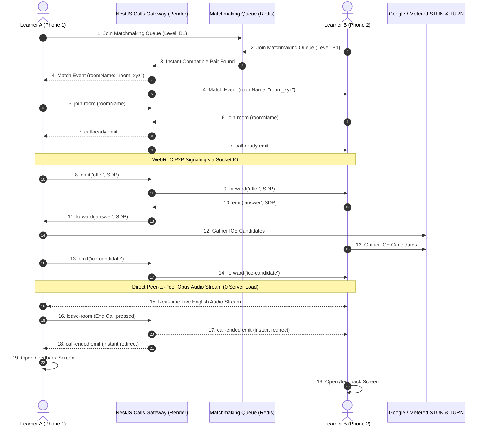

# 📱 FluentUp - Complete Architecture & Development Guide

> **"Find someone. Speak English. Get better naturally."**  
> Complete full-stack end-to-end blueprint, technology stack documentation, WebRTC audio pipeline, matchmaking engine, and step-by-step production build guide for the **FluentUp** Real-time English Speaking Mobile Application.

---

## 📑 Table of Contents
1. [Project Overview & Philosophy](#1-project-overview--philosophy)
2. [Complete Technology Stack](#2-complete-technology-stack)
3. [System Architecture & Data Flow](#3-system-architecture--data-flow)
4. [Folder Structure & Component Breakdown](#4-folder-structure--component-breakdown)
5. [Core Engines & How They Work](#5-core-engines--how-they-work)
   - 5.1 [Authentication & Google Sign-In](#51-authentication--google-sign-in)
   - 5.2 [Direct Onboarding & Assessment Bypass](#52-direct-onboarding--assessment-bypass)
   - 5.3 [Smart 30-Second Matchmaking Engine](#53-smart-30-second-matchmaking-engine)
   - 5.4 [Native WebRTC Audio & STUN/TURN Signaling](#54-native-webrtc-audio--stunturn-signaling)
   - 5.5 [Bluetooth Neckband / TWS Audio Routing](#55-bluetooth-neckband--tws-audio-routing)
   - 5.6 [Screen Sleep Prevention (`KeepAwake`)](#56-screen-sleep-prevention-keepawake)
   - 5.7 [Synchronized Call Termination & Feedback](#57-synchronized-call-termination--feedback)
6. [Database Schema (Neon PostgreSQL + Prisma)](#6-database-schema-neon-postgresql--prisma)
7. [Step-by-Step Setup & Deployment Guide](#7-step-by-step-setup--deployment-guide)
   - 7.1 [Local Development Setup](#71-local-development-setup)
   - 7.2 [Backend Deployment on Render.com](#72-backend-deployment-on-rendercom)
   - 7.3 [Building Android APK via Expo Application Services (EAS)](#73-building-android-apk-via-expo-application-services-eas)
8. [Production Troubleshooting & Best Practices](#8-production-troubleshooting--best-practices)

---

## 1. Project Overview & Philosophy

**FluentUp** is a zero-clutter, peer-to-peer live oral English practice platform. Unlike traditional learning apps loaded with boring grammar exercises or social media feeds, FluentUp connects two real learners into an active, low-stress 1-on-1 audio call within **30 seconds**.

### Core Pillars:
- **Zero Distraction:** No text chat during calls, no video pressure, no complex gamification tokens.
- **Beginner Frictionless:** No mandatory pre-assessment test for new users—anyone can open the app, tap **"Find a partner"**, and start speaking.
- **Zero Server Audio Bandwidth Cost:** Audio flows directly device-to-device via **WebRTC P2P (Opus 32kbps mono)**. The backend handles only lightweight signaling.
- **Battery & Screen Stability:** Hardware keep-awake prevents Android aggressive battery killers from cutting calls when the screen sleeps.
- **Hardware Agnostic:** Seamlessly routes between phone earpiece, loud speakerphone, and Bluetooth wireless neckbands/TWS earbuds.

---

## 2. Complete Technology Stack

| Layer | Technology | Version | Purpose |
| :--- | :--- | :--- | :--- |
| **Mobile Frontend** | [React Native](https://reactnative.dev/) | `0.81.5` | Cross-platform native mobile foundation |
| **App Framework** | [Expo SDK](https://expo.dev/) | `~54.0.36` | Managed native modules, compilation, & asset pipeline |
| **File-Based Routing** | [Expo Router](https://docs.expo.dev/router/introduction/) | `~6.0.24` | Modern URL-style stack & tab navigation |
| **State Management** | React Context + Hooks | `React 19` | Global session, auth, audio, and matchmaking state |
| **Local Storage** | `@react-native-async-storage` | `2.2.0` | Offline auth token, user profile, and cached local avatar |
| **P2P Audio Streaming** | [react-native-webrtc](https://github.com/react-native-webrtc/react-native-webrtc) | `^124.0.8` | Native C++ WebRTC stack for low-latency peer-to-peer audio |
| **Audio Mode & Hardware** | `expo-av` | `^16.0.8` | Android audio focus, earpiece, speaker, & background mode |
| **Display Persistence** | `expo-keep-awake` | `~15.0.8` | Prevents screen sleep & socket freezes during conversations |
| **Signaling Client** | [Socket.IO Client](https://socket.io/) | `^4.8.3` | Real-time WebSocket connection to backend signaling room |
| **OAuth Authentication** | `@react-native-google-signin` | `^16.1.5` | 1-Tap native Google Sign-In |
| **Backend Framework** | [NestJS](https://nestjs.com/) | `^10.3.8` | Enterprise TypeScript REST API and WebSocket Gateway |
| **WebSockets Gateway** | `@nestjs/platform-socket.io` | `^10.4.22` | Handles room creation, SDP Offer/Answer, & ICE exchange |
| **Relational Database** | [Neon Serverless PostgreSQL](https://neon.tech/) | Postgres 16 | Distributed cloud SQL database for users, calls & ratings |
| **ORM** | [Prisma ORM](https://www.prisma.io/) | `^5.22.0` | Type-safe database queries, schema migrations, and seeding |
| **In-Memory Cache** | [Redis / Upstash](https://upstash.com/) | `ioredis ^6.0.0`| Real-time 30-sec matchmaking waiting queue |
| **Admin & Security** | [Firebase Admin SDK](https://firebase.google.com/) | `^14.3.0` | JWT verification for Firebase & dev access tokens |
| **Backend Hosting** | [Render.com](https://render.com/) | Linux Node 20 | Web service for NestJS API + WebSocket gateway |
| **APK Cloud Builder** | [Expo EAS Build](https://expo.dev/eas) | Latest CLI | Cloud build engine compiling clean release/preview APKs |

---

## 3. System Architecture & Data Flow



---

## 4. Folder Structure & Component Breakdown

```
FluentUp mobile app/
├── fluentUp/                           # Frontend (React Native + Expo SDK 54)
│   ├── app/                            # Expo Router File-Based Screens
│   │   ├── _layout.tsx                 # Root layout with AppProvider & global stack
│   │   ├── welcome.tsx                 # Hero editorial onboarding & marketing screen
│   │   ├── auth.tsx                    # Email/Password + Google 1-Tap Sign-In
│   │   ├── verify-email.tsx            # Frictionless email verification & bypass
│   │   ├── matchmaking.tsx             # 30-sec animated radar & queue matching
│   │   ├── partner-found.tsx           # 3..2..1 transition screen with partner profile
│   │   ├── call.tsx                    # Active Audio Call Screen (waveform, controls)
│   │   ├── feedback.tsx                # Post-call 5-star rating & reflection screen
│   │   ├── (tabs)/                     # Primary Authenticated App Tabs
│   │   │   ├── _layout.tsx             # Bottom Tab Bar setup
│   │   │   ├── index.tsx               # Hero Home Screen (Speak CTA, PulseOrb)
│   │   │   └── profile.tsx             # User Profile, stats, and optional level test
│   │   └── assessment/                 # Future-Ready Level Assessment Flow
│   │       ├── intro.tsx               # Assessment introduction
│   │       ├── index.tsx               # 10 diagnostic questions
│   │       ├── result-pass.tsx         # Pass screen with CEFR badge
│   │       └── result-fail.tsx         # Retry screen
│   ├── components/                     # Reusable UI Widgets
│   │   ├── BrandLogo.tsx               # Typography-driven brand mark
│   │   ├── PulseOrb.tsx                # Living breathing microphone CTA button
│   │   ├── WaveformVisualizer.tsx      # Real-time animated audio soundbars
│   │   └── EndCallSheet.tsx            # Safety confirmation sheet before ending call
│   ├── constants/
│   │   ├── config.ts                   # Backend URL & WebSocket configuration
│   │   └── theme.ts                    # Curated HSL Color Tokens & typography
│   ├── context/
│   │   └── AppContext.tsx              # Single source of truth for global state
│   ├── services/
│   │   ├── api.ts                      # Axios/Fetch HTTP REST client
│   │   ├── socket.ts                   # Socket.IO client for signaling & room sync
│   │   └── webrtc.ts                   # Native WebRTC peer connection manager
│   ├── app.json                        # Expo app metadata, plugins, & permissions
│   ├── package.json                    # Frontend dependencies
│   └── tsconfig.json                   # TypeScript compiler configuration
│
└── server/                             # Backend (NestJS + Prisma + Socket.IO)
    ├── src/
    │   ├── main.ts                     # NestJS bootstrap entry point & CORS config
    │   ├── app.module.ts               # Root module orchestrating all micro-modules
    │   ├── auth/                       # Authentication & Firebase verification
    │   │   ├── auth.controller.ts      # Profile endpoints
    │   │   ├── auth.service.ts         # User record queries
    │   │   ├── firebase.service.ts     # Firebase admin token decoding
    │   │   └── guards/                 # FirebaseAuthGuard with dev-token fallback
    │   ├── matchmaking/                # Real-time queue logic
    │   │   ├── matchmaking.controller.ts
    │   │   └── matchmaking.service.ts  # Redis queue pooling & pairing
    │   ├── calls/                      # Audio signaling & session accounting
    │   │   ├── calls.controller.ts     # Session history, ice-servers, & end-call
    │   │   ├── calls.gateway.ts        # WebSocket CallsGateway (WebRTC signaling)
    │   │   └── calls.service.ts        # Spoken minutes crediting & feedback storage
    │   ├── assessment/                 # CEFR diagnostic question bank
    │   │   ├── assessment.controller.ts
    │   │   └── assessment.service.ts
    │   └── prisma/
    │       └── prisma.service.ts       # Database client connection
    ├── prisma/
    │   ├── schema.prisma               # Database models & indexes
    │   └── seed.ts                     # Seed sample users and assessment questions
    ├── .env                            # Environment secrets (Neon DB, Redis, etc.)
    └── package.json                    # Backend dependencies
```

---

## 5. Core Engines & How They Work

### 5.1 Authentication & Google Sign-In
* Supports both native **Google 1-Tap OAuth** via `@react-native-google-signin/google-signin` and **Email/Password** authentication.
* Auto-populates the learner's display name and Google profile picture into local storage without requiring database asset uploads.
* Uses lightweight developer tokens (`dev-token-<cleanId>`) for instant sandbox authentication and Firebase ID tokens in production.

### 5.2 Direct Onboarding & Assessment Bypass
* **Frictionless Onboarding:** When a new learner registers, their profile is immediately set to `approvalStatus: 'APPROVED'` with a baseline fluency level of `B1 (Intermediate)` and 75% score.
* The mandatory assessment barrier has been removed from the registration flow. As soon as the user logs in, they land straight on the Home screen and can start matchmaking with **zero friction**.
* **Future-Ready:** The assessment module (`/assessment/*`) remains intact in the codebase. An optional entry point, **"Test English Level (Optional)"**, is provided on the Profile screen so experienced learners can test their CEFR rating whenever they wish.

### 5.3 Smart 30-Second Matchmaking Engine
The matching algorithm works in 3 progressive tiers:
1. **0–10 seconds:** Exact level match (e.g., `B1 <-> B1` or `B2 <-> B2`).
2. **10–20 seconds:** Adjacent level match (e.g., `B1 <-> B2`).
3. **20–30 seconds:** Wider compatible range with expanded search.
4. If no real peer is available after 30 seconds, a fallback prompt allows the user to retry or practice with an alternate queue.

### 5.4 Native WebRTC Audio & STUN/TURN Signaling
* **Microphone Access:** Android runtime permission `RECORD_AUDIO` is requested dynamically.
* **Deterministic Role Assignment:** When matched, `user.id < partner.id` determines which client acts as the WebRTC Caller (creating the SDP Offer) and which client acts as the Callee (creating the SDP Answer).
* **High-Reliability ICE Servers:** Bundles Google's public STUN servers (`stun:stun.l.google.com:19302`) with Metered global TURN relays (`turn:openrelay.metered.ca:443`) to guarantee NAT traversal even on strict Carrier-Grade NAT mobile networks (Jio, Airtel 4G/5G).
* **Opus Voice Optimization:**
  - `useinbandfec=1`: Forward Error Correction prevents jitter and packet loss on cellular data.
  - `usedtx=1`: Discontinuous Transmission conserves battery during pauses in speech.
  - `maxaveragebitrate=32000`: Optimal 32 kbps voice clarity for human conversation.

### 5.5 Bluetooth Neckband / TWS Audio Routing
* **Android 12+ Permission:** Manifest includes `android.permission.BLUETOOTH_CONNECT`, `BLUETOOTH_ADMIN`, and `BLUETOOTH`.
* **Hardware Audio Routing:** Configured in `webrtcService.setAudioRoute(route)`:
  - `bluetooth`: Prioritizes Bluetooth SCO / A2DP so wireless headsets capture speech from the neckband mic and play incoming audio through the earbuds.
  - `speaker`: Forces Android loudspeaker for hands-free mode.
  - `earpiece`: Routes audio to the phone's top earpiece receiver.
* **UI Dynamic Switcher:** Call screen features a floating 3-way toggle button that cycles between:
  `Bluetooth (🎧) ➔ Speaker (🔊) ➔ Earpiece (📱) ➔ Bluetooth (🎧)`.

### 5.6 Screen Sleep Prevention (`KeepAwake`)
* **Problem Solved:** When a user is in a long call and puts the phone down or the screen locks, Android suspends background WebSocket network sockets, killing the call unexpectedly.
* **Solution:** `safeKeepAwake` activates `activateKeepAwakeAsync('fluentup-call-screen')` on call screen mount and safely releases it on unmount. Screen lock is prevented during live conversations without crashing native module layers.

### 5.7 Synchronized Call Termination & Feedback
* When either user taps **"End Conversation"**, the client emits `leave-room` to the WebSocket gateway.
* The NestJS gateway immediately broadcasts `call-ended` to **both** room participants.
* The remote peer's app intercepts `call-ended` or `partner-disconnected`, terminates the WebRTC audio stream cleanly, and redirects both users to `/feedback`.
* Both users are credited with spoken practice minutes in the database, and their completed sessions counter increments automatically.

---

## 6. Database Schema (Neon PostgreSQL + Prisma)

File: `server/prisma/schema.prisma`

```prisma
datasource db {
  provider = "postgresql"
  url      = env("DATABASE_URL")
}

generator client {
  provider = "prisma-client-js"
}

enum FluencyLevel {
  A1
  A2
  B1
  B2
  C1
  C2
}

enum ApprovalStatus {
  PENDING
  APPROVED
  REJECTED
}

enum CallStatus {
  INITIATED
  ACTIVE
  COMPLETED
  FAILED
}

model User {
  id              String         @id @default(uuid())
  firebaseUid     String         @unique
  email           String         @unique
  username        String
  level           FluencyLevel   @default(B1)
  approvalStatus  ApprovalStatus @default(APPROVED)
  assessmentScore Int            @default(75)
  totalSessions   Int            @default(0)
  totalMinutes    Int            @default(0)
  topTopic        String?        @default("Everyday English")
  address         String?
  education       String?
  hobbies         String[]       @default(["English Practice", "Traveling"])
  bio             String?
  photoUrl        String?
  isBlocked       Boolean        @default(false)
  createdAt       DateTime       @default(now())
  updatedAt       DateTime       @updatedAt

  callsAsA        Call[]         @relation("UserACalls")
  callsAsB        Call[]         @relation("UserBCalls")
  feedbacksGiven  CallFeedback[]
}

model Call {
  id              String         @id @default(uuid())
  roomName        String         @unique
  userAId         String
  userBId         String
  userA           User           @relation("UserACalls", fields: [userAId], references: [id])
  userB           User           @relation("UserBCalls", fields: [userBId], references: [id])
  status          CallStatus     @default(INITIATED)
  sharedTopic     String?
  startedAt       DateTime       @default(now())
  endedAt         DateTime?
  durationSeconds Int            @default(0)
  feedbacks       CallFeedback[]
}

model CallFeedback {
  id          String   @id @default(uuid())
  callId      String
  call        Call     @relation(fields: [callId], references: [id], onDelete: Cascade)
  authorId    String
  author      User     @relation(fields: [authorId], references: [id])
  rating      Int      @default(5)
  flowQuality String   @default("great")
  createdAt   DateTime @default(now())
}
```

---

## 7. Step-by-Step Setup & Deployment Guide

### 7.1 Local Development Setup

#### Prerequisites:
- Node.js `20.x` or higher
- npm `10.x` or higher
- Git installed on your operating system
- Android Studio with Android Virtual Device (AVD) OR a physical Android phone with USB Debugging enabled

#### 1. Clone the Repository:
```bash
git clone https://github.com/Praveen31111/fluentUp.git
cd "FluentUp mobile app"
```

#### 2. Backend Server Setup:
```bash
cd server
npm install
npx prisma generate
npm run start:dev
```
*Backend runs on `http://localhost:3000` with live WebSocket signaling on port `3000`.*

#### 3. Mobile App Setup:
```bash
cd ../fluentUp
npm install
npx expo start
```
*Scan the QR code in Expo Go or launch on an Android emulator by pressing `a`.*

---

### 7.2 Backend Deployment on Render.com

1. Go to [Render.com Dashboard](https://dashboard.render.com/) and click **New + ➔ Web Service**.
2. Connect your GitHub repository: `https://github.com/Praveen31111/fluentUp`.
3. Configure the service:
   - **Root Directory:** `server`
   - **Environment:** `Node`
   - **Build Command:** `npm install && npx prisma generate && npm run build`
   - **Start Command:** `npm run start:prod`
4. Add the following **Environment Variables** in Render Settings:
   - `DATABASE_URL`: `postgresql://<user>:<password>@<neon-host>/fluentup?sslmode=require`
   - `REDIS_URL`: `redis://default:<password>@<upstash-host>:6379`
   - `PORT`: `3000`
5. Click **Deploy Web Service**. Once deployed, your production URL will be:
   `https://fluentup-backend.onrender.com`

---

### 7.3 Building Android APK via Expo Application Services (EAS)

To produce an installable standalone `.apk` for distribution to users:

#### 1. Configure EAS Credentials:
```bash
cd fluentUp
npm install -g eas-cli
npx eas login
```

#### 2. Configure `eas.json` (Preview APK Profile):
Verify that `fluentUp/eas.json` has the `preview` profile configured with APK build type:
```json
{
  "build": {
    "preview": {
      "distribution": "internal",
      "android": {
        "buildType": "apk"
      }
    }
  }
}
```

#### 3. Trigger the APK Cloud Build:
```bash
npx eas build --platform android --profile preview --clear-cache
```

#### 4. Download & Install:
- Once the cloud build completes (typically 5–10 minutes), EAS provides a download URL and QR code.
- Download the `.apk` file directly to any Android smartphone, tap **Install**, and grant microphone permissions to start practicing live.

---

## 8. Production Troubleshooting & Best Practices

| Issue / Symptom | Root Cause | Solution |
| :--- | :--- | :--- |
| **"FluentUp keeps stopping" on startup** | Native module dependency version mismatch (e.g. `expo-keep-awake` v57 on Expo 54). | Always run `npx expo install --check` and use SDK 54 compatible versions (`~15.0.8`). Ensure `safeKeepAwake` fallback is present. |
| **Call disconnects when screen turns off** | Android OS kills background WebSockets during deep sleep. | Ensure `safeKeepAwake.activate()` runs inside `call.tsx` and heartbeat ping is set to `15s`. |
| **Partner doesn't disconnect when I hang up** | Socket room left before remote notification reached gateway. | Gateway now automatically emits `call-ended` on `handleDisconnect` and REST `/calls/:roomName/end`. |
| **Audio coming from phone instead of Bluetooth** | Missing Android 12+ `BLUETOOTH_CONNECT` permission or audio mode forced to earpiece. | Ensure `BLUETOOTH_CONNECT` is in `app.json` and use `setAudioRoute('bluetooth')`. |
| **P2P Audio fails on cellular 4G/5G networks** | Symmetric NAT traversal blocked without relay. | Turn on the Metered TURN relay servers configured in `webrtc.ts` (`turn:openrelay.metered.ca:443`). |

---

*Authored by the FluentUp Core Engineering Team. For questions or enterprise support, open an issue in the repository.*
