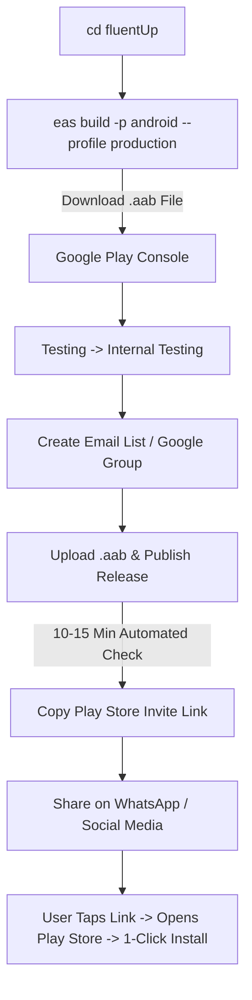

# ⚡ FluentUp - Google Play Internal Testing Guide (15-Minute Zero-Warning Deployment)

Yeh document **FluentUp** ko bina kisi "Harmful file" warning ke, direct **Google Play Store** se 2–3 second me install karwane ka complete step-by-step practical guide hai. 

Is method se aap **15 se 30 minute ke andar** dosto aur users ko official Play Store link bhej sakte hain.

---

## 🎯 Internal Testing Ke Fayde
1. **0% Harmful File Warning**: Chrome browser ka "File might be harmful" warning 100% khatam ho jata hai.
2. **Instant Approval (Zero Review Delay)**: Google ki manual review team ka 3–5 din ka wait nahi karna padta. Automated check 10–15 minute me pass ho jata hai.
3. **Superfast Play Store Download**: Play Store `.aab` bundle se phone ke hisab se lightweight split file download karta hai, jo 2 se 3 second me install ho jati hai.
4. **Up to 100 Users**: Aap ek sath 100 logo ko official link bhej kar app use karwa sakte hain.

---

## 📋 Step-by-Step Execution Plan



---

### 📌 STEP 1: Production `.aab` Bundle Build Karein (Expo EAS)

Google Play Store APK nahi leta, sirf **Android App Bundle (.aab)** leta hai.

1. Terminal me `fluentUp` folder me jayein aur command chalayein:
   ```bash
   cd fluentUp
   eas build -p android --profile production
   ```
2. Agar terminal puche:
   ```
   ? Would you like Expo to generate a keystore for you?
   ```
   Select karein: **`Yes (Recommended)`**  
   *(Expo aapki signing key securely save kar lega).*
3. Build complete hone par terminal me link aayega (jaise `https://expo.dev/artifacts/eas/...aab`).
4. Us link par click karke **`.aab`** file apne computer me download kar lijiye.

---

### 📌 STEP 2: Google Play Console Me App Create Karein

1. [Google Play Console](https://play.google.com/console) open karke login karein.
2. Top-right corner par **"Create app"** button par click karein.
3. Details bharein:
   * **App name**: `FluentUp - English Speaking Practice`
   * **Default language**: `English (United States)`
   * **App or game**: `App`
   * **Free or paid**: `Free`
   * Niche ke dono Declarations accept karein.
4. **"Create app"** button dabayein.

---

### 📌 STEP 3: "Internal Testing" Section Me Jayein

1. Play Console ke left side menu me scroll karein.
2. **Testing** section ke andar **"Internal testing"** par click karein.

---

### 📌 STEP 4: Testers Ki List Banayein

1. Internal testing page par upar **"Testers"** tab par click karein.
2. **"Create email list"** button par tap karein:
   * **List name**: `FluentUp Core Users`
   * **Email addresses**: Yahan apni Gmail ID aur dosto/learners ki Gmail IDs enter karein (comma laga kar aap 100 logo ki Gmail add kar sakte hain).
   * *(Note: Agar 20 log nahi hain to tension mat lijiye, aap sirf 2 ya 5 Gmail IDs daal kar bhi start kar sakte hain).*
3. **"Save changes"** par click karein.
4. Us list ke samne wale checkbox ko **Tick (Select)** karein aur niche **"Save"** dabayein.

---

### 📌 STEP 5: `.aab` File Upload Karke Publish Karein

1. Internal testing page par **"Releases"** tab par jayein.
2. Right side me **"Create new release"** button dabayein.
3. **App bundles** box me Step 1 me download ki hui `.aab` file drag-and-drop karein (upload hone me 1–2 minute lagega).
4. **Release name**: `1.0.0 (1)` automatically likha aayega.
5. **Release notes**: Yahan likhein:
   ```text
   Initial internal release of FluentUp - 1-on-1 English practice with voice and video calls.
   ```
6. Bottom right me **"Next"** dabayein.
7. Next page par **"Save and publish to Internal testing"** par click karein.

> ⚡ **Kamaal ki baat**: Yahan Google ka koi 3–5 din ka manual review nahi hota! Sirf 10 se 15 minute ke andar status **"Available to internal testers"** ho jata hai.

---

### 📌 STEP 6: Official Google Play Store Link Copy Karein

1. Wapas **"Testers"** tab me jayein.
2. Page ke sabse aakhri (bottom) me scroll karein.
3. Wahan ek section hoga: **"How testers join your test"**.
4. Wahan link dikhega:
   * **Web link**: `https://play.google.com/apps/internaltest/...`
5. **"Copy link"** button par click karein.

---

### 📌 STEP 7: WhatsApp Par Share Karein & User Ka Experience 📱

Yeh link aap apne doston/users ko WhatsApp par share karein:

```text
Hey! FluentUp is now available on Google Play Store for 1-on-1 English speaking practice:
https://play.google.com/apps/internaltest/xxxxxxxxx
```

#### User ke Phone Me Kya Hoga (Super Smooth Experience):
1. User WhatsApp par link par tap karega.
2. Official Google ka web page open hoga:  
   **"FluentUp - You've been invited to test this app"**.
3. User **"Accept invite"** ka blue button dabayega.
4. Screen par button aayega: **"Download it on Google Play"**.
5. Tap karte hi phone me direct **Google Play Store App** open ho jayega jisme FluentUp ka icon aur green **"Install"** button hoga!
6. **"Install"** dabate hi 2–3 second me app download ho jayega:
   * ❌ **Koi "File might be harmful" warning nahi**
   * ❌ **Koi Chrome download alert nahi**
   * ❌ **Koi Play Protect block nahi**
   * ✅ **100% Official Google Play Store Download!**

---

## 🔄 Naye Updates Kaise Bhejein? (Fast Updates)
Aage chalkar jab aap app me naye features add karenge:
1. `fluentUp/app.json` me:
   * `"version"` ko `"1.0.1"` karein.
   * `"versionCode"` ko `1` se badha kar `2` karein.
2. Naya `.aab` banayein: `eas build -p android --profile production`
3. Internal testing me jakar naya release create karein aur `.aab` upload karein.
4. Sabhi testers ke phone me Play Store **automatically background me app update** kar dega!
