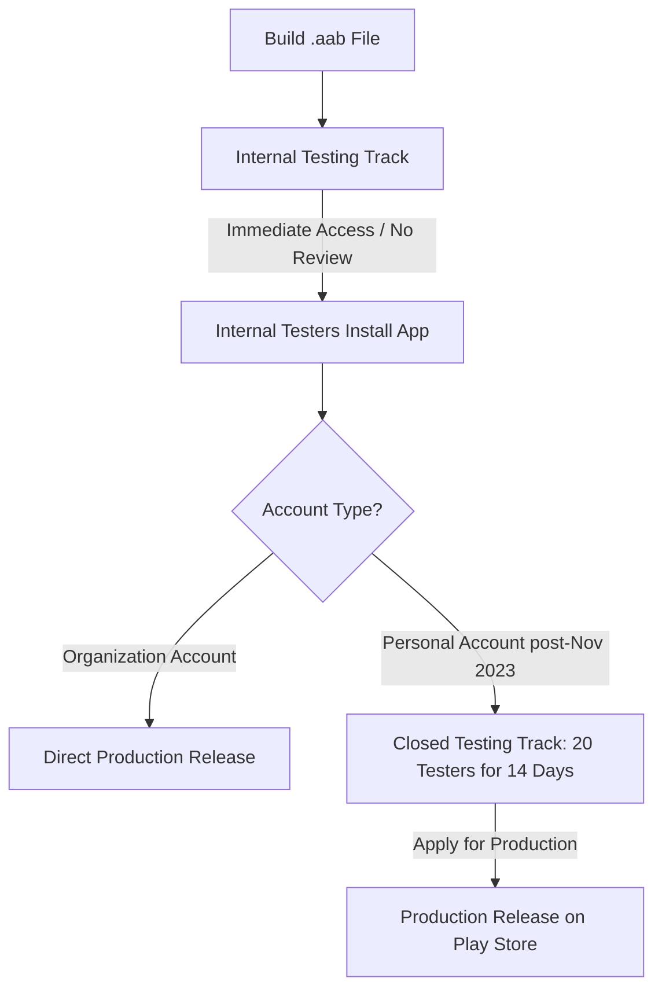

 # 🚀 FluentUp - Google Play Store Deployment Plan (Complete Step-by-Step Guide)

Yeh guide **FluentUp** mobile app ko **Google Play Store** par shuru se lekar live publish karne tak ka complete roadmap hai. Isme account setup, assets, permissions declaration, privacy policy, `.aab` production build, testing tracks aur review approval ke sabhi steps shamil hain.

---

## 📑 Table of Contents
1. [Prerequisites & Requirements (Kya-kya chahiye)](#1-prerequisites--requirements)
2. [Mandatory Graphics & Assets (Banners, Icons, Screenshots)](#2-mandatory-graphics--assets)
3. [Privacy Policy & Legal URL (Free 0-Cost Setup)](#3-privacy-policy--legal-url)
4. [App Configuration & Versioning (`app.json`)](#4-app-configuration--versioning)
5. [EAS Production Build (.aab Generation)](#5-eas-production-build-aab-generation)
6. [Google Play Console Setup (Step-by-Step)](#6-google-play-console-setup)
7. [Data Safety & Permissions Declaration (Crucial Step)](#7-data-safety--permissions-declaration)
8. [Testing Tracks: Internal vs Closed (14-Day Tester Rule)](#8-testing-tracks-internal-vs-closed)
9. [Submitting for Review & Going Live](#9-submitting-for-review--going-live)
10. [Post-Launch Monitoring & Future Updates](#10-post-launch-monitoring--future-updates)

---

## 1. Prerequisites & Requirements

| Item | Requirement | Details | Cost |
| :--- | :--- | :--- | :--- |
| **Google Play Developer Account** | Mandatory | Google account par ek baar register karna hota hai. | **$25 (approx ₹2,100)** One-time lifetime fee |
| **Identity Verification** | Mandatory | Aadhaar / PAN / Passport / Driving License + Address proof. | Free |
| **Credit / Debit Card** | Mandatory | International transaction enabled Visa / MasterCard for $25 payment. | — |
| **Active Website / Webpage** | Mandatory | Privacy Policy host karne ke liye (GitHub Pages ya Vercel par 100% Free). | **₹0.00** |
| **Support Email** | Mandatory | Users ke support ke liye (jaise `support.fluentup@gmail.com`). | **₹0.00** |

---

## 2. Mandatory Graphics & Assets

Google Play Console par app submit karne ke liye niche diye gaye exact dimensions ke graphics ready hone chahiye:

### 1. App Icon
* **Dimension**: `512 x 512 px`
* **Format**: 32-bit PNG
* **Max Size**: 1024 KB
* **Design**: High resolution FluentUp logo (no transparent background).

### 2. Feature Graphic (Main Banner)
* **Dimension**: `1024 x 500 px`
* **Format**: PNG ya JPEG
* **Max Size**: 15 MB
* **Design**: FluentUp branding tagline: *"Speak English Naturally · 1-on-1 Voice & Video Practice"*.

### 3. App Screenshots (Phone)
* **Quantity**: Minimum 2 screenshots, Maximum 8 screenshots.
* **Resolution**: Minimum `1080 x 1920 px` (16:9 ya 9:16 aspect ratio).
* **Screenshots to capture**:
  1. **Home Screen**: Audio call card, Video call card, Unlimited Calling badge.
  2. **Matchmaking Screen**: Animated radar finding global partners.
  3. **Call Screen (Audio & Video)**: Live call controls, mute, video flip.
  4. **Profile & Fluency Assessment**: CEFR Level badge (B2/C1), hobbies, stats.
  5. **Friends Tab**: Add friends, direct practice partners.

---

## 3. Privacy Policy & Legal URL

Google Play Store par Camera aur Microphone permission use karne wale har app ke liye **Privacy Policy URL mandatory** hota hai. Agar privacy policy nahi hogi to app reject ho jayega.

### Zero-Cost Privacy Policy Hosting (GitHub Pages / Vercel):
Aap ek simple HTML file bana kar GitHub Pages ya Vercel par host kar sakte hain:

* **URL Example**: `https://praveen31111.github.io/fluentup-privacy-policy/`
* **Key Policy Points jo hona zaroori hain**:
  1. **Microphone Access**: Used strictly for real-time peer-to-peer 1-on-1 English conversations. Audio is not recorded or stored on any server.
  2. **Camera Access**: Used strictly for real-time peer-to-peer video conversations. Video streams are transmitted directly phone-to-phone via WebRTC and never recorded.
  3. **User Data**: Name, email, CEFR level, and profile photo stored securely for matchmaking and friend list.
  4. **Data Deletion**: Users can delete their account and data anytime by contacting support.

---

## 4. App Configuration & Versioning (`app.json`)

Play Store par upload karne se pehle `fluentUp/app.json` me `versionCode` specify karna zaroori hota hai:

```json
{
  "expo": {
    "name": "FluentUp",
    "slug": "fluentup",
    "version": "1.0.0",
    "android": {
      "package": "com.fluentUp.app",
      "versionCode": 1,
      "permissions": [
        "android.permission.RECORD_AUDIO",
        "android.permission.MODIFY_AUDIO_SETTINGS",
        "android.permission.INTERNET",
        "android.permission.ACCESS_NETWORK_STATE",
        "android.permission.CAMERA",
        "android.permission.WAKE_LOCK",
        "android.permission.FOREGROUND_SERVICE",
        "android.permission.FOREGROUND_SERVICE_MICROPHONE",
        "android.permission.BLUETOOTH",
        "android.permission.BLUETOOTH_CONNECT"
      ]
    }
  }
}
```

> **Note**: Har naye update ke waqt `versionCode` ko `1` se badha kar `2`, `3`, `4` karna hota hai.

---

## 5. EAS Production Build (.aab Generation)

Google Play Store ab `.apk` accept nahi karta, sirf **Android App Bundle (.aab)** accept karta hai.

### Step 1: Production Build Command
Terminal me run karein:
```bash
cd fluentUp
eas build -p android --profile production
```

### Step 2: EAS Keystore Prompt
Jab terminal puche:
```
? Would you like Expo to generate a keystore for you?
```
Select karein: **`Yes (Recommended)`**  
Expo aapki signing key ko secure cloud me store kar lega taaki future updates me key match ho sake.

### Step 3: Download `.aab`
Build finish hone par terminal me link aayegi jaha se aap **`fluentup-production.aab`** download kar sakte hain.

---

## 6. Google Play Console Setup

### Step 1: Create App
1. [Google Play Console](https://play.google.com/console) me login karein.
2. **"Create app"** button par click karein.
3. Details bharein:
   * **App name**: `FluentUp - English Speaking Practice`
   * **Default language**: `English (United States)`
   * **App or game**: `App`
   * **Free or paid**: `Free`
   * Declarations accept karein aur **Create app** dabayein.

### Step 2: Store Listing Setup (Dashboard $\rightarrow$ Store Presence)
* **Short Description** (Max 80 chars):  
  *`Practice spoken English 1-on-1 with live partners via voice and video calls.`*
* **Full Description** (Max 4000 chars):  
  *FluentUp helps you become fluent and confident in English through real-time 1-on-1 voice and video practice. Match with learners worldwide at your fluency level, practice daily conversation topics, make friends, and improve your pronunciation with zero judgment.*
* **App Icon**: `512x512 PNG` upload karein.
* **Feature Graphic**: `1024x500 PNG` upload karein.
* **Phone Screenshots**: Minimum 4 high quality screenshots upload karein.

---

## 7. Data Safety & Permissions Declaration

Play Store console me **"App content"** section me ye questionnaires complete karna zaroori hai:

### 1. Privacy Policy
* Apna hosted Privacy Policy link paste karein.

### 2. App Access
* Select karein: **"All functionality is available without special access"** (ya test credentials provide karein agar login zaroori hai).

### 3. Ads
* Select karein: **"No, my app does not contain ads"**.

### 4. Content Rating
* Questionnaire bharein:
  * Category: Social / Communication
  * Does app share physical location? No.
  * Does app allow users to interact/communicate? **Yes (Voice & Video call)**.
  * Rating generate hogi (Generally **12+** ya **Teen** due to open peer communication).

### 5. Target Audience
* Select: **18 and above** (isse Google Kids Policy ki strict restrictions se bacha ja sake).

### 6. Data Safety Form (Very Important)
* **Does your app collect or share user data?**: **Yes**.
* **Data Types**:
  1. **Name & Email**: For account management (collected, not shared, encrypted in transit).
  2. **Audio / Voice Recordings**: Select **No** (Kyunki WebRTC audio stream real-time P2P hoti hai, server par store nahi hoti).
  3. **Photos / Videos**: If profile picture upload is enabled, select **Personal info / Photos**.
* **Is data encrypted in transit?**: **Yes** (HTTPS & WSS SSL).
* **Can users request data deletion?**: **Yes**.

### 7. Microphone & Camera Declarations
* Purpose: Explain karein: *"FluentUp uses microphone and camera exclusively for peer-to-peer real-time English conversation practice between paired learners."*

---

## 8. Testing Tracks: Internal vs Closed

Google ne November 2023 ke baad naye personal developer accounts ke liye ek naya rule lagaya hai:



### Track 1: Internal Testing (Start Here! ⚡)
* **Kyu zaroori hai**: Is track me Google ka **koi approval review delay nahi hota**. Jaise hi aap `.aab` upload karte hain, 5 minute ke andar Play Store ka download link mil jata hai.
* **Fayda**:
  * Chrome ka **"Harmful file"** warning turant **khatam** ho jata hai!
  * Play Store se **1-click me 3 second me install** ho jata hai.
  * Aap 100 email address daal kar apne dosto/testers ko link share kar sakte hain.

### Track 2: Closed Testing (20 Testers for 14 Days)
* Agar aapka Google Play Console account personal account hai, to Google Play Store production release ke liye:
  * **20 testers** ko invite karna hota hai.
  * Testers ko app **14 continuous days** tak opt-in rakhna hota hai.
  * 14 days poore hone par Console me **"Apply for production"** ka button activate ho jata hai.

---

## 9. Submitting for Review & Going Live

1. **Upload .aab**:
   * Console me **Release $\rightarrow$ Production** (ya Closed Testing) par jayein.
   * **Create new release** dabayein aur `fluentup-production.aab` upload karein.
   * Release name: `1.0.0 (1)`.
   * Release notes: `Initial release of FluentUp - 1-on-1 English Practice with voice and video calls.`
2. **Review & Rollout**:
   * **"Review release"** par click karein.
   * Check karein koi red errors na ho (warnings ignore kar sakte hain).
   * **"Start rollout to Production"** dabayein.
3. **Approval Time**:
   * Google review team 2 se 5 business days me app review karti hai.
   * Approve hone par app Play Store par search me aane lagta hai!

---

## 10. Post-Launch & Future Updates Checklist

Jab bhi aap app me koi naya feature (jaise Admin Dashboard, Daily Topic ya Friends UI update) add karenge:
1. `fluentUp/app.json` me:
   * `"version"` ko `"1.0.1"` karein.
   * `"versionCode"` ko `1` se badha kar `2` karein.
2. Naya bundle banayein:
   ```bash
   eas build -p android --profile production
   ```
3. Naye `.aab` ko Play Console me upload karke rollout kar dein. Play Store existing users ke phone me background me automatically app update kar dega!

---

✅ **Deployment file created successfully at [play-store-deployment-plan.md](file:///c:/Users/pc/FluentUp%20mobile%20app/play-store-deployment-plan.md)**
